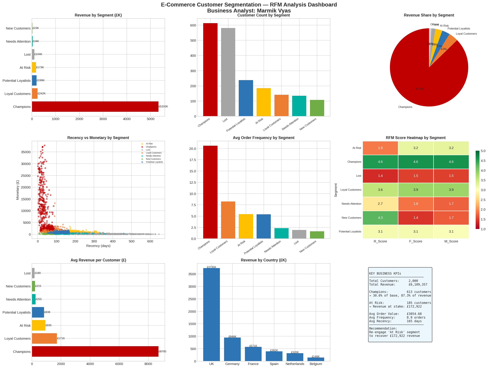

# 🛒 E-Commerce Customer Segmentation — RFM Analysis

> **Role:** Business Analyst · Data Analyst
> **Tools:** Python · Pandas · Scikit-Learn · Matplotlib · Seaborn
> **Domain:** E-Commerce / Retail / CRM

---

## 🧩 Business Problem

An e-commerce company with **2,000 customers** and **£6M+ annual revenue** had no structured way to understand customer behaviour. Marketing campaigns were sent to all customers equally — wasting budget on already-loyal customers and missing at-risk ones entirely.

The business needed:
- A data-driven customer segmentation framework
- Clear identification of high-value vs churning customers
- Actionable retention strategies mapped to each segment
- A foundation for personalised, channel-specific marketing

---

## 🎯 BA Approach — RFM Methodology

RFM is a proven customer analytics framework used by leading e-commerce and retail businesses:

| Dimension | Definition | Scoring |
|-----------|-----------|---------|
| **R — Recency** | Days since last purchase | Lower = better (scored 5→1) |
| **F — Frequency** | Number of orders placed | Higher = better (scored 1→5) |
| **M — Monetary** | Total spend (lifetime) | Higher = better (scored 1→5) |

Each customer receives an R/F/M score (1–5), combined into a composite RFM score, then mapped to one of **7 behavioural segments**.

---

## 👥 Customer Segments Identified

| Segment | Customers | Revenue | Avg Recency | Strategy |
|---------|-----------|---------|-------------|----------|
| **Champions** | 613 (30.6%) | £5.33M (87.3%) | 40 days | Reward + upsell premium |
| **Loyal Customers** | 141 (7.1%) | £242K (4.0%) | 90 days | Loyalty points + early access |
| **Potential Loyalists** | 238 (11.9%) | £199K (3.3%) | 126 days | Subscription/membership offer |
| **At Risk** | 185 (9.3%) | £173K (2.8%) | 218 days | Win-back: 15% discount campaign |
| **Lost** | 581 (29.1%) | £104K (1.7%) | 336 days | Last-chance reactivation email |
| **New Customers** | 107 (5.4%) | £23K (0.4%) | 57 days | Onboarding drip + 2nd purchase push |
| **Needs Attention** | 135 (6.8%) | £34K (0.6%) | 155 days | Targeted category campaign |

---

## 📊 Key Business Insights

- **Top 30.6% of customers generate 87.3% of revenue** — Champions must be protected at all costs
- **185 At-Risk customers represent £173K recoverable revenue** — the highest-ROI retention target
- **Lost segment (29% of base) contributes only 1.7% of revenue** — minimal budget should be allocated here
- **New Customers need a structured onboarding journey** — first 45 days are critical for conversion to loyalists

---

## 📁 Repository Structure

```
ecommerce-rfm-customer-segmentation/
│
├── ecommerce_rfm_analysis.py        # Full RFM scoring + segmentation + dashboard
├── rfm_dashboard.png                # 9-panel customer analytics dashboard
├── rfm_scores.csv                   # Customer-level RFM scores and segments
├── transactions.csv                 # Transaction-level dataset (17,726 records)
├── retention_strategy_map.csv       # Segment-to-action mapping (BA deliverable)
└── README.md
```

---

## 🔍 Dashboard Preview



**Panels include:**
- Revenue by Segment (horizontal bar)
- Customer Count by Segment
- Revenue Share Pie Chart
- Recency vs Monetary Scatter (coloured by segment)
- Avg Order Frequency by Segment
- RFM Score Heatmap (R/F/M per segment)
- Revenue per Customer by Segment
- Revenue by Country
- KPI Summary Box

---

## 📋 Segment-to-Action Mapping (BA Deliverable)

| Segment | Priority | Action | Channel | Goal |
|---------|----------|--------|---------|------|
| Champions | 🔴 High | Reward + upsell premium | Email + App Push | Maintain frequency |
| Loyal Customers | 🔴 High | Loyalty points + early access | Email + SMS | Increase basket size |
| At Risk | 🔴 High | 15% win-back campaign | Email + Retargeting | Re-engage before lost |
| Potential Loyalists | 🟡 Medium | Subscription offer | Email + In-app | Increase frequency |
| New Customers | 🟡 Medium | Onboarding drip series | Email | Drive 2nd purchase |
| Needs Attention | 🟢 Low | Past-category campaign | Email | Re-engage |
| Lost | 🟢 Low | Last-chance strong offer | Email only | Final reactivation |

---

## 🛠️ How to Run

```bash
pip install pandas numpy matplotlib seaborn scikit-learn

python ecommerce_rfm_analysis.py
```

---

## 🏷️ Tags
`business-analyst` `rfm-analysis` `customer-segmentation` `ecommerce` `crm` `retention-strategy` `python` `pandas` `matplotlib` `customer-analytics`
